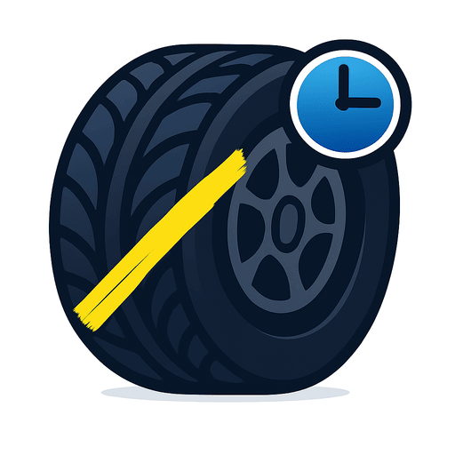

  

# TireChalk

This isn't the actual TireChalk repo — the source is private for now. You can open issues here for bug reports, feature requests, or feedback until the project is made public, at which point issues will move to the public repository.

## About

TireChalk is a crowdsourcing reporting platform where tire admirers unite to celebrate the art of chalk scribbles on wheels, one curious gaze at a time!

Learn more on the [TireChalk app](https://i2c.space/tirechalk).

Or check out the [TireChalk how-to user guide](https://i2c.space/docs/tirechalk/tirechalk-guide) or the [FAQ](https://i2c.space/tirechalk/faq).

## Issues

- Bug reports: please include steps to reproduce, what you expected, and what happened.
- Feature requests: describe the use case, not just the feature.
- Questions: feel free to open an issue.

---

  

# TireChalk (Français)

Ceci n'est pas le véritable dépôt TireChalk — le code source est privé pour le moment. Vous pouvez ouvrir des tickets ici pour signaler des bogues, proposer des fonctionnalités ou laisser vos commentaires en attendant que le projet devienne public, après quoi les tickets seront déplacés vers le dépôt public.

## À propos

TireChalk est une plateforme de signalement participative où les admirateurs de pneus s'unissent pour célébrer l'art des gribouillis de craie sur les roues, un regard curieux à la fois !

Pour en savoir plus, consultez l'[application TireChalk](https://i2c.space/tirechalk).

Ou consultez le [guide d'utilisation TireChalk](https://i2c.space/fr/docs/tirechalk/tirechalk-guide) ou la [FAQ](https://i2c.space/fr/docs/tirechalk/tirechalk-faq).

## Tickets

- Rapports de bogues : merci d'inclure les étapes pour reproduire, le résultat attendu et le résultat obtenu.
- Demandes de fonctionnalités : décrivez le cas d'usage, pas seulement la fonctionnalité.
- Questions : n'hésitez pas à ouvrir un ticket.
